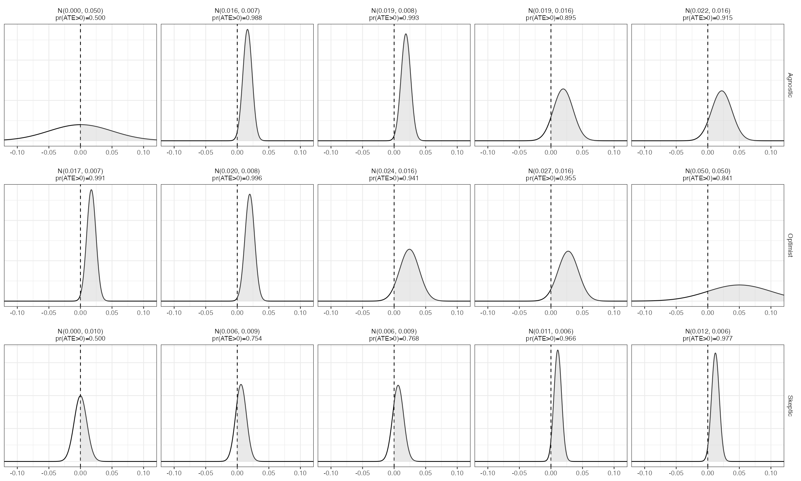

# Active Maintenance Report: green_etal_2016

2026-08-01

- [Summary](#summary)
  - [Does the deposited archive run?](#does-the-deposited-archive-run)
  - [Does the maintained rewrite reproduce the
    paper?](#does-the-maintained-rewrite-reproduce-the-paper)
- [Paper overview](#paper-overview)
- [Original archive reproducibility](#original-archive-reproducibility)
  - [The Experiment 2 seed](#the-experiment-2-seed)
- [Number-by-number comparison](#number-by-number-comparison)
- [Maintained rewrite](#maintained-rewrite)
  - [Architecture](#architecture)
  - [Deprecated patterns replaced](#deprecated-patterns-replaced)
- [Randomization inference](#randomization-inference)
- [Figure 2 verification](#figure-2-verification)
- [Maintained rewrite verification](#maintained-rewrite-verification)
- [R environment](#r-environment)

*Drafted by Claude Opus 5 under the supervision of Alex Coppock.*

This repository holds the actively maintained replication code for
Green, Krasno, Coppock, Farrer, Lenoir and Zingher (2016), together with
the reproducibility report that documents what the original archive did
and did not do. It is part of a program applying the maintenance
proposal in Peer, Orr and Coppock (2021, *PS: Political Science &
Politics*, doi
[10.1017/S1049096521000366](https://doi.org/10.1017/S1049096521000366))
to a set of published archives.

|  |  |
|----|----|
| Article | [10.1016/j.electstud.2015.12.002](https://doi.org/10.1016/j.electstud.2015.12.002) |
| Replication archive | [10.7910/DVN/K2TLDB](https://doi.org/10.7910/DVN/K2TLDB) |
| Pre-analysis plan (Experiment 3) | [osf.io/umysq](https://osf.io/umysq) |
| Pre-analysis plan (Experiment 4) | [osf.io/ejfgk](https://osf.io/ejfgk) |

**The data are not redistributed here.** The deposit is 12 MB across 33
files and lives at Harvard Dataverse, which is the only copy this
repository points at. `download_original.R` fetches it and verifies
every file; `original_manifest.csv` pins the file identifiers, sizes and
checksums, so the exact bytes this code was written against are recorded
in version control even though the bytes themselves are not.

**Repository layout.** `maintained/` is the maintained rewrite: one
script per published table or figure, writing to `output/`, which is
committed so a reader can compare a fresh run against it without
downloading anything. `ground_truth/` ties every published number to the
code that produces it. `original/` is created by the download script and
is deliberately absent from the repository. This file is the
reproducibility report, also available as a PDF in `report/`.

**License.** CC0 1.0 Universal, matching the terms of the deposit this
repository maintains. See `LICENSE`.

**To reproduce.** Clone or download the repository, open
`green_etal_2016.Rproj`, and run:

``` r
source("run_all.R")
```

That fetches the deposit, verifies its 33 files, and produces every
table and figure into `maintained/output/`. Required packages:
tidyverse, estimatr, metafor, gridExtra, knitr, kableExtra, here. Paths
resolve through `here`, so nothing depends on the working directory. The
full run takes about two minutes, almost all of it in the randomization
inference, which refits 120,000 pairs of weighted models across 40,000
permutations. A successful run overwrites `maintained/output/`, which is
committed: **`git diff` on that folder is the reproduction check.**

# Summary

Two questions, answered before the detail.

## Does the deposited archive run?

Yes. All six analysis scripts execute without error on a current R
installation, with no hardcoded paths, no functions called before they
are defined, and no deprecated calls that have since been removed. Every
package they name still installs from CRAN, including `beepr` 2.0, which
only one of the random-assignment scripts calls, to play a sound on
completion.

Running is not the same as reproducing, and one number changes.
`Experiment_2_Analysis.R` picks the observed treatment assignment out of
a matrix of 10,000 admissible randomizations with
`set.seed(12345); sample(1:10000, 1)`. R 3.6.0 changed how `sample()`
converts uniform draws to integers, so that line returned column 7210
when the paper was written and returns column 8243 today. Column 7210 is
the assignment that was actually deployed, and it is the one the
archive’s own pre-saved `exp_2.RData` encodes, so the archive contains
the right answer and the live script path no longer finds it. 10 of the
146 claims an archive script can be checked against therefore fail to
reproduce, all of them in Table 4 and in the Experiment 2 randomization
inference p-value, and all from that one line.

## Does the maintained rewrite reproduce the paper?

Yes, without exception. All 191 verifiable ground truth claims match the
published values to reported precision, including every panel label of
Figure 2. The remaining 8 recorded quantities are randomization
inference p-values for vote margin and turnout, which the scripts
compute but the article and its appendix never state; they are marked
unverifiable rather than matched.

The rewrite reaches Experiment 2 through the pre-saved `exp_2.RData`
object rather than through the seed, which is what makes it immune to
the R version change. Reaching it any other way is a live hazard rather
than a hypothetical one: until August 2026 the rewrite’s randomization
inference script took Experiment 2’s observed assignment from its own
cleaning script, which redraws the seed, and consequently reported 0.79
where the article reports 0.90. That script now reads the same canonical
object as everything else.

# Paper overview

**Citation**: Green, D. P., Krasno, J. S., Coppock, A., Farrer, B. D.,
Lenoir, B. and Zingher, J. N. (2016). “The effects of lawn signs on vote
outcomes: Results from four randomized field experiments.” *Electoral
Studies*, 41, 143-150. DOI: 10.1016/j.electstud.2015.12.002

**Summary**: Four randomized field experiments test whether lawn signs
change vote outcomes. In each, geographic units (electoral districts or
precincts) were assigned to receive signs, to be adjacent to a unit that
received signs, or to neither, so that each experiment estimates a
direct effect and a spillover effect at once. Because adjacency makes
the assignment probabilities unequal across units, every estimate is
inverse-probability weighted, and inference is randomization based: an
observed F-statistic for the joint null of no direct and no indirect
effect is compared against 10,000 pre-computed admissible
randomizations. The four experiments are a 2012 congressional general
election in New York, a 2013 mayoral primary in Albany, a 2013
gubernatorial general election in Virginia, and a 2014 state senate
primary in Pennsylvania. Pooling the four by fixed-effects meta-analysis
gives a direct effect of 1.7 percentage points of vote share (SE 0.7)
and a spillover effect of 1.5 points (SE 0.6).

# Original archive reproducibility

| Script | Status on current R | Resolution |
|:---|:---|:---|
| Lawn_Signs_Source.R | Clean (sourced by all scripts) | No changes required |
| Experiment_1_Analysis.R | Clean | No changes required |
| Experiment_2_Analysis.R | Runs clean, but Table 4 and the Experiment 2 p-value no longer reproduce | set.seed(12345, sample.kind = ‘Rounding’), or read the deposited exp_2.RData |
| Experiment_3_Analysis.R | Clean | No changes required |
| Experiment_4_Analysis.R | Clean | No changes required |
| Pooled_analysis.R | Clean | No changes required |
| in_text_calculations.R | Clean | No changes required |
| Experiment_1_RA_Function.R | Parses; regenerates a deposited matrix, not re-run | None needed: its output is deposited |
| Experiment_2_RA_Function.R | Parses; regenerates a deposited matrix, not re-run | None needed: its output is deposited |
| Experiment_3_RA_Function.R | Parses; regenerates a deposited matrix, not re-run | None needed: its output is deposited |
| Experiment_4_RA_Function.R | Parses; needs beepr, which installs from CRAN | install.packages(‘beepr’) |

Original archive reproducibility, checked against R 4.6.0 on 1 August
2026.

Every package the archive names still installs from CRAN: `stargazer`,
`xtable`, `sandwich`, `lmtest`, `ggplot2`, `dplyr`, `randomizr`, `beepr`
and `rmeta`. The last of these is the fragile one. `rmeta` 3.0 has not
been updated since March 2018 and survives on CRAN by its archiving
policy rather than by maintenance, and `Pooled_analysis.R` depends on it
for a single call to `meta.summaries()`. The maintained rewrite pools
with `metafor::rma(method = "FE")` instead, so it does not inherit the
exposure.

The four `*_RA_Function.R` scripts regenerate the permutation matrices
from scratch. They parse cleanly and their packages install, but they
were not re-run to completion: they are stochastic, they take a long
time, and the matrices they build are themselves deposited, so
re-running them would replace a deposited object with a different one
rather than check anything.

## The Experiment 2 seed

The one substantive failure has nothing to do with packages.
`Experiment_2_Analysis.R` opens by drawing the observed treatment
assignment out of the deposited permutation matrix:

``` r
set.seed(12345)
chosen.rand <- sample(1:10000, 1)
```

R 3.6.0, released in April 2019, replaced the “Rounding” method that
`sample()` used to convert uniform variates to integers with a
“Rejection” method. The same seed therefore selects a different column
than it did when the analysis was run: 7210 under the old method, 8243
under the new one. The two columns are different treatment assignments
and give different answers.

Column 7210 is the assignment the experiment actually used. Three
independent checks agree on that: it is the column the archive’s own
pre-saved `exp_2.RData` encodes, it is the column whose treated set
matches the authors’ record of which districts received signs, and it is
what `set.seed(12345, sample.kind = "Rounding")` returns on any R
version. Column 7210 also reproduces the published Table 4 and the
published Experiment 2 p-value; column 8243 reproduces neither.

| Quantity            | Published | Column 7210 (R \< 3.6) | Column 8243 (R 3.6+) |
|:--------------------|:----------|:-----------------------|:---------------------|
| Table 4 M1 treated  | 0.009     | 0.009                  | 0.130                |
| Table 4 M2 treated  | -0.014    | -0.014                 | 0.019                |
| Section 5.2 p-value | 0.90      | 0.897                  | 0.794                |

What the Experiment 2 permutation column decides.

The archive is not wrong. It contains both the script and the object the
script was meant to produce, and the object is correct. What it lacks is
any signal that the two have come apart, which is the failure this
maintenance program exists to catch: a reader running the deposited
script today gets numbers that differ from the paper, with no error and
no warning.

# Number-by-number comparison

| Location | Exp. | Arm | Model | Quantity | Paper | Archive | Match |
|:---|:---|:---|:---|:---|:---|:---|:---|
| table_2 | all | Control | n | N | 16 | 16 | 1 |
| table_2 | all | Adjacent | n | N | 49 | 49 | 1 |
| table_2 | all | Treated | n | N | 23 | 23 | 1 |
| table_2 | all | Control | n | N | 13 | 13 | 1 |
| table_2 | all | Adjacent | n | N | 41 | 41 | 1 |
| table_2 | all | Treated | n | N | 15 | 15 | 1 |
| table_2 | all | Control | n | N | 25 | 25 | 1 |
| table_2 | all | Adjacent | n | N | 76 | 76 | 1 |
| table_2 | all | Treated | n | N | 30 | 30 | 1 |
| table_2 | all | Control | n | N | 24 | 24 | 1 |
| table_2 | all | Adjacent | n | N | 44 | 44 | 1 |
| table_2 | all | Treated | n | N | 20 | 20 | 1 |
| table_3 | 1 | Treated | M1 | coef | 0.025 | 0.025 | 1 |
| table_3 | 1 | Treated | M1 | SE | 0.027 | 0.027 | 1 |
| table_3 | 1 | Adjacent | M1 | coef | 0.037 | 0.037 | 1 |
| table_3 | 1 | Adjacent | M1 | SE | 0.027 | 0.027 | 1 |
| table_3 | 1 | Treated | M2 | coef | 0.025 | 0.025 | 1 |
| table_3 | 1 | Treated | M2 | SE | 0.017 | 0.017 | 1 |
| table_3 | 1 | Adjacent | M2 | coef | 0.018 | 0.018 | 1 |
| table_3 | 1 | Adjacent | M2 | SE | 0.016 | 0.016 | 1 |
| table_3 | 1 | all | M1 | N | 88 | 88 | 1 |
| table_3 | 1 | all | M1 | R2 | 0.031 | 0.031 | 1 |
| table_3 | 1 | all | M2 | R2 | 0.823 | 0.823 | 1 |
| table_4 | 2 | Treated | M1 | coef | 0.009 | 0.13 | 0 |
| table_4 | 2 | Treated | M1 | SE | 0.054 | 0.08 | 0 |
| table_4 | 2 | Adjacent | M1 | coef | 0.012 | 0.137 | 0 |
| table_4 | 2 | Adjacent | M1 | SE | 0.046 | 0.072 | 0 |
| table_4 | 2 | Treated | M2 | coef | -0.014 | 0.019 | 0 |
| table_4 | 2 | Treated | M2 | SE | 0.057 | 0.053 | 0 |
| table_4 | 2 | Adjacent | M2 | coef | 0.004 | 0.028 | 0 |
| table_4 | 2 | Adjacent | M2 | SE | 0.045 | 0.035 | 0 |
| table_4 | 2 | all | M1 | N | 69 | 69 | 1 |
| table_4 | 2 | all | M1 | R2 | 0.001 | 0.13 | 0 |
| table_5 | 3 | Treated | M1 | coef | 0.042 | 0.042 | 1 |
| table_5 | 3 | Treated | M1 | SE | 0.016 | 0.016 | 1 |
| table_5 | 3 | Adjacent | M1 | coef | 0.042 | 0.042 | 1 |
| table_5 | 3 | Adjacent | M1 | SE | 0.013 | 0.013 | 1 |
| table_5 | 3 | Treated | M2 | coef | 0.018 | 0.018 | 1 |
| table_5 | 3 | Treated | M2 | SE | 0.009 | 0.009 | 1 |
| table_5 | 3 | Adjacent | M2 | coef | 0.018 | 0.018 | 1 |
| table_5 | 3 | Adjacent | M2 | SE | 0.007 | 0.007 | 1 |
| table_5 | 3 | all | M1 | N | 131 | 131 | 1 |
| table_5 | 3 | all | M1 | R2 | 0.094 | 0.094 | 1 |
| table_5 | 3 | all | M2 | R2 | 0.825 | 0.825 | 1 |
| table_6 | 4 | Treated | M1 | coef | -0.013 | -0.013 | 1 |
| table_6 | 4 | Treated | M1 | SE | 0.028 | 0.028 | 1 |
| table_6 | 4 | Adjacent | M1 | coef | -0.023 | -0.023 | 1 |
| table_6 | 4 | Adjacent | M1 | SE | 0.022 | 0.022 | 1 |
| table_6 | 4 | Treated | M2 | coef | -0.012 | -0.012 | 1 |
| table_6 | 4 | Treated | M2 | SE | 0.026 | 0.026 | 1 |
| table_6 | 4 | Adjacent | M2 | coef | -0.02 | -0.02 | 1 |
| table_6 | 4 | Adjacent | M2 | SE | 0.021 | 0.021 | 1 |
| table_6 | 4 | all | M1 | N | 88 | 88 | 1 |
| table_6 | 4 | all | M1 | R2 | 0.012 | 0.012 | 1 |
| table_6 | 4 | all | M2 | R2 | 0.172 | 0.172 | 1 |
| table_7 | all | Treated | pooled | coef_exp1 | 0.025 | 0.025 | 1 |
| table_7 | all | Treated | pooled | SE_exp1 | 0.017 | 0.017 | 1 |
| table_7 | all | Treated | pooled | coef_exp2 | -0.014 | -0.014 | 1 |
| table_7 | all | Treated | pooled | SE_exp2 | 0.057 | 0.057 | 1 |
| table_7 | all | Treated | pooled | coef_exp3 | 0.018 | 0.018 | 1 |
| table_7 | all | Treated | pooled | SE_exp3 | 0.009 | 0.009 | 1 |
| table_7 | all | Treated | pooled | coef_exp4 | -0.012 | -0.012 | 1 |
| table_7 | all | Treated | pooled | SE_exp4 | 0.026 | 0.026 | 1 |
| table_7 | all | Treated | pooled | coef_pooled | 0.017 | 0.017 | 1 |
| table_7 | all | Treated | pooled | SE_pooled | 0.007 | 0.007 | 1 |
| table_7 | all | Adjacent | pooled | coef_exp1 | 0.018 | 0.018 | 1 |
| table_7 | all | Adjacent | pooled | SE_exp1 | 0.016 | 0.016 | 1 |
| table_7 | all | Adjacent | pooled | coef_exp2 | 0.004 | 0.004 | 1 |
| table_7 | all | Adjacent | pooled | SE_exp2 | 0.045 | 0.045 | 1 |
| table_7 | all | Adjacent | pooled | coef_exp3 | 0.018 | 0.018 | 1 |
| table_7 | all | Adjacent | pooled | SE_exp3 | 0.007 | 0.007 | 1 |
| table_7 | all | Adjacent | pooled | coef_exp4 | -0.02 | -0.02 | 1 |
| table_7 | all | Adjacent | pooled | SE_exp4 | 0.021 | 0.021 | 1 |
| table_7 | all | Adjacent | pooled | coef_pooled | 0.015 | 0.015 | 1 |
| table_7 | all | Adjacent | pooled | SE_pooled | 0.006 | 0.006 | 1 |
| table_8 | 1 | Treated | het | coef | 0.031 | 0.031 | 1 |
| table_8 | 1 | Treated | het | SE | 0.017 | 0.017 | 1 |
| table_8 | 1 | Adjacent | het | coef | 0.021 | 0.021 | 1 |
| table_8 | 1 | Adjacent | het | SE | 0.014 | 0.014 | 1 |
| table_8 | 1 | party_share | het | coef | 0.027 | 0.027 | 1 |
| table_8 | 1 | party_share | het | SE | 0.042 | 0.042 | 1 |
| table_8 | 1 | Treated:party_share | het | coef | 0.031 | 0.031 | 1 |
| table_8 | 1 | Treated:party_share | het | SE | 0.03 | 0.03 | 1 |
| table_8 | 1 | Adjacent:party_share | het | coef | 0.011 | 0.011 | 1 |
| table_8 | 1 | Adjacent:party_share | het | SE | 0.025 | 0.025 | 1 |
| table_8 | 1 | all | het | N | 88 | 88 | 1 |
| table_8 | 1 | all | het | R2 | 0.829 | 0.829 | 1 |
| table_8 | 2 | Treated | het | coef | -0.009 | -0.009 | 1 |
| table_8 | 2 | Treated | het | SE | 0.06 | 0.06 | 1 |
| table_8 | 2 | Adjacent | het | coef | 0.011 | 0.011 | 1 |
| table_8 | 2 | Adjacent | het | SE | 0.046 | 0.046 | 1 |
| table_8 | 2 | party_share | het | coef | -0.02 | -0.02 | 1 |
| table_8 | 2 | party_share | het | SE | 0.033 | 0.033 | 1 |
| table_8 | 2 | Treated:party_share | het | coef | 0.033 | 0.033 | 1 |
| table_8 | 2 | Treated:party_share | het | SE | 0.063 | 0.063 | 1 |
| table_8 | 2 | Adjacent:party_share | het | coef | 0.053 | 0.053 | 1 |
| table_8 | 2 | Adjacent:party_share | het | SE | 0.033 | 0.033 | 1 |
| table_8 | 2 | all | het | N | 69 | 69 | 1 |
| table_8 | 2 | all | het | R2 | 0.277 | 0.277 | 1 |
| table_8 | 3 | Treated | het | coef | 0.02 | 0.02 | 1 |
| table_8 | 3 | Treated | het | SE | 0.009 | 0.009 | 1 |
| table_8 | 3 | Adjacent | het | coef | 0.02 | 0.02 | 1 |
| table_8 | 3 | Adjacent | het | SE | 0.007 | 0.007 | 1 |
| table_8 | 3 | party_share | het | coef | 0.028 | 0.028 | 1 |
| table_8 | 3 | party_share | het | SE | 0.009 | 0.009 | 1 |
| table_8 | 3 | Treated:party_share | het | coef | 0.01 | 0.01 | 1 |
| table_8 | 3 | Treated:party_share | het | SE | 0.008 | 0.008 | 1 |
| table_8 | 3 | Adjacent:party_share | het | coef | 0.008 | 0.008 | 1 |
| table_8 | 3 | Adjacent:party_share | het | SE | 0.008 | 0.008 | 1 |
| table_8 | 3 | all | het | N | 131 | 131 | 1 |
| table_8 | 3 | all | het | R2 | 0.829 | 0.829 | 1 |
| table_8 | 4 | Treated | het | coef | -0.014 | -0.014 | 1 |
| table_8 | 4 | Treated | het | SE | 0.026 | 0.026 | 1 |
| table_8 | 4 | Adjacent | het | coef | -0.02 | -0.02 | 1 |
| table_8 | 4 | Adjacent | het | SE | 0.021 | 0.021 | 1 |
| table_8 | 4 | party_share | het | coef | 0.02 | 0.02 | 1 |
| table_8 | 4 | party_share | het | SE | 0.021 | 0.021 | 1 |
| table_8 | 4 | Treated:party_share | het | coef | -0.021 | -0.021 | 1 |
| table_8 | 4 | Treated:party_share | het | SE | 0.027 | 0.027 | 1 |
| table_8 | 4 | Adjacent:party_share | het | coef | -0.016 | -0.016 | 1 |
| table_8 | 4 | Adjacent:party_share | het | SE | 0.02 | 0.02 | 1 |
| table_8 | 4 | all | het | N | 88 | 88 | 1 |
| table_8 | 4 | all | het | R2 | 0.181 | 0.181 | 1 |
| ri_table | 1 | all | RI | p_margin |  | 0.16 |  |
| ri_table | 1 | all | RI | p_share | 0.22 | 0.22 | 1 |
| ri_table | 1 | all | RI | p_turnout |  | 0.53 |  |
| ri_table | 2 | all | RI | p_margin |  | 0.29 |  |
| ri_table | 2 | all | RI | p_share | 0.9 | 0.79 | 0 |
| ri_table | 2 | all | RI | p_turnout |  | 0.44 |  |
| ri_table | 3 | all | RI | p_margin |  | 0.26 |  |
| ri_table | 3 | all | RI | p_share | 0.02 | 0.02 | 1 |
| ri_table | 3 | all | RI | p_turnout |  | 0.33 |  |
| ri_table | 4 | all | RI | p_margin |  | 0.88 |  |
| ri_table | 4 | all | RI | p_share | 0.77 | 0.77 | 1 |
| ri_table | 4 | all | RI | p_turnout |  | 0.85 |  |
| appendix_C1 | 1 | Treated | M1 | coef | 15.582 | 15.582 | 1 |
| appendix_C1 | 1 | Treated | M1 | SE | 28.327 | 28.327 | 1 |
| appendix_C1 | 1 | Adjacent | M1 | coef | -9.242 | -9.242 | 1 |
| appendix_C1 | 1 | Adjacent | M1 | SE | 27.305 | 27.305 | 1 |
| appendix_C1 | 1 | Treated | M2 | coef | 34.786 | 34.786 | 1 |
| appendix_C1 | 1 | Treated | M2 | SE | 18.207 | 18.207 | 1 |
| appendix_C1 | 1 | Adjacent | M2 | coef | 11.713 | 11.713 | 1 |
| appendix_C1 | 1 | Adjacent | M2 | SE | 17.885 | 17.885 | 1 |
| appendix_C1 | 1 | Treated | M1_turnout | coef | 53.002 | 53.002 | 1 |
| appendix_C1 | 1 | Treated | M1_turnout | SE | 48.748 | 48.748 | 1 |
| appendix_C1 | 1 | Adjacent | M1_turnout | coef | 110.329 | 110.329 | 1 |
| appendix_C1 | 1 | Adjacent | M1_turnout | SE | 52.796 | 52.796 | 1 |
| appendix_C1 | 1 | Treated | M2_turnout | coef | 10.331 | 10.331 | 1 |
| appendix_C1 | 1 | Treated | M2_turnout | SE | 15.741 | 15.741 | 1 |
| appendix_C1 | 1 | Adjacent | M2_turnout | coef | 11.914 | 11.914 | 1 |
| appendix_C1 | 1 | Adjacent | M2_turnout | SE | 11.759 | 11.759 | 1 |
| footnote_4 | all | all | intext | total_turnout | 241613 | 241613 | 1 |
| footnote_4 | all | all | intext | cost_per_vote_direct | 3.18 | 3.18 | 1 |
| footnote_4 | all | all | intext | cost_per_vote_total | 1.69 | 1.69 | 1 |
| figure_2 | Agnostic | Prior |  | posterior_mean | 0 |  |  |
| figure_2 | Agnostic | Prior |  | posterior_sd | 0.05 |  |  |
| figure_2 | Agnostic | Prior |  | pr_ate_positive | 0.5 |  |  |
| figure_2 | Agnostic | Update 1 |  | posterior_mean | 0.022 |  |  |
| figure_2 | Agnostic | Update 1 |  | posterior_sd | 0.016 |  |  |
| figure_2 | Agnostic | Update 1 |  | pr_ate_positive | 0.915 |  |  |
| figure_2 | Agnostic | Update 2 |  | posterior_mean | 0.019 |  |  |
| figure_2 | Agnostic | Update 2 |  | posterior_sd | 0.016 |  |  |
| figure_2 | Agnostic | Update 2 |  | pr_ate_positive | 0.895 |  |  |
| figure_2 | Agnostic | Update 3 |  | posterior_mean | 0.019 |  |  |
| figure_2 | Agnostic | Update 3 |  | posterior_sd | 0.008 |  |  |
| figure_2 | Agnostic | Update 3 |  | pr_ate_positive | 0.993 |  |  |
| figure_2 | Agnostic | Update 4 |  | posterior_mean | 0.016 |  |  |
| figure_2 | Agnostic | Update 4 |  | posterior_sd | 0.007 |  |  |
| figure_2 | Agnostic | Update 4 |  | pr_ate_positive | 0.988 |  |  |
| figure_2 | Optimist | Prior |  | posterior_mean | 0.05 |  |  |
| figure_2 | Optimist | Prior |  | posterior_sd | 0.05 |  |  |
| figure_2 | Optimist | Prior |  | pr_ate_positive | 0.841 |  |  |
| figure_2 | Optimist | Update 1 |  | posterior_mean | 0.027 |  |  |
| figure_2 | Optimist | Update 1 |  | posterior_sd | 0.016 |  |  |
| figure_2 | Optimist | Update 1 |  | pr_ate_positive | 0.955 |  |  |
| figure_2 | Optimist | Update 2 |  | posterior_mean | 0.024 |  |  |
| figure_2 | Optimist | Update 2 |  | posterior_sd | 0.016 |  |  |
| figure_2 | Optimist | Update 2 |  | pr_ate_positive | 0.941 |  |  |
| figure_2 | Optimist | Update 3 |  | posterior_mean | 0.02 |  |  |
| figure_2 | Optimist | Update 3 |  | posterior_sd | 0.008 |  |  |
| figure_2 | Optimist | Update 3 |  | pr_ate_positive | 0.996 |  |  |
| figure_2 | Optimist | Update 4 |  | posterior_mean | 0.017 |  |  |
| figure_2 | Optimist | Update 4 |  | posterior_sd | 0.007 |  |  |
| figure_2 | Optimist | Update 4 |  | pr_ate_positive | 0.991 |  |  |
| figure_2 | Skeptic | Prior |  | posterior_mean | 0 |  |  |
| figure_2 | Skeptic | Prior |  | posterior_sd | 0.01 |  |  |
| figure_2 | Skeptic | Prior |  | pr_ate_positive | 0.5 |  |  |
| figure_2 | Skeptic | Update 1 |  | posterior_mean | 0.006 |  |  |
| figure_2 | Skeptic | Update 1 |  | posterior_sd | 0.009 |  |  |
| figure_2 | Skeptic | Update 1 |  | pr_ate_positive | 0.768 |  |  |
| figure_2 | Skeptic | Update 2 |  | posterior_mean | 0.006 |  |  |
| figure_2 | Skeptic | Update 2 |  | posterior_sd | 0.009 |  |  |
| figure_2 | Skeptic | Update 2 |  | pr_ate_positive | 0.754 |  |  |
| figure_2 | Skeptic | Update 3 |  | posterior_mean | 0.012 |  |  |
| figure_2 | Skeptic | Update 3 |  | posterior_sd | 0.006 |  |  |
| figure_2 | Skeptic | Update 3 |  | pr_ate_positive | 0.977 |  |  |
| figure_2 | Skeptic | Update 4 |  | posterior_mean | 0.011 |  |  |
| figure_2 | Skeptic | Update 4 |  | posterior_sd | 0.006 |  |  |
| figure_2 | Skeptic | Update 4 |  | pr_ate_positive | 0.966 |  |  |

Ground truth: published value against the value the deposited scripts
produce on current R. A blank Match means the quantity is not stated in
the article or its appendix, or that the archive prints no comparable
value.

Of the 199 recorded claims, 146 can be compared against what a deposited
script prints. 136 of those match the published value and 10 do not,
every one of the failures traceable to the Experiment 2 seed.

# Maintained rewrite

The rewrite lives in `maintained/`: fifteen scripts covering four
cleaning steps, seven published tables, the appendix margin and turnout
tables, Figure 2, and the randomization inference. It is a translation,
not a reanalysis: every estimator, specification and sample restriction
is the one the paper used.

## Architecture

Each experiment’s analysis reads the archive’s canonical `exp_N.RData`
object, which carries both the analysis frame and that experiment’s
10,000-column permutation matrix. The `clean_expN.R` scripts rebuild the
same frames from the raw deposited files in tidy form and are the
readable account of how each variable is constructed, but no published
number is taken from them. That separation is deliberate and
load-bearing: `clean_exp2.R` redraws the observed assignment with the
same seed the archive uses, and therefore selects the wrong column on
any current R.

Weighted models use `estimatr::lm_robust(se_type = "HC2")` in place of
`lm()` followed by a `coeftest(fit, vcovHC(fit, type = "HC2"))` wrapper,
which is the same estimator with the same standard errors. Pooling uses
`metafor::rma(method = "FE")` in place of `rmeta::meta.summaries()`. The
randomization inference reimplements the archive’s `get_f()` as
`f_treat()` in `helpers.R` and loops over the deposited permutation
matrices, computing all four experiments rather than carrying any
p-value forward as a constant.

## Deprecated patterns replaced

| Original pattern | Replacement |
|:---|:---|
| `rm(list = ls())` | (omitted) |
| `setwd("")` | `here::here()` |
| `lm()` + `coeftest(vcovHC, 'HC2')` | `estimatr::lm_robust(se_type = "HC2")` |
| `rmeta::meta.summaries(method = 'fixed')` | `metafor::rma(method = "FE")` |
| `stargazer` + `sink()` | `write_csv()` to `output/` |
| `xtable` + `print.xtable` | `write_csv()` to `output/` |
| `within()` blocks over base indexing | `mutate()` paragraphs |
| `merge()` | `left_join()` |
| `multiplot()` (grid-based) | `gridExtra::arrangeGrob()` |
| `pdf()` / `png()` devices | `ggsave()` |
| `library(beepr)` + `beep()` | (omitted) |
| magrittr pipe | native pipe |

Deprecated patterns and their replacements in the maintained rewrite.

# Randomization inference

The article reports one randomization inference p-value per experiment,
for vote share, in sections 5.1 through 5.4. All four reproduce.

| Experiment   | Outcome | Rewrite | Published |
|:-------------|:--------|:--------|:----------|
| Experiment 1 | share   | 0.2225  | 0.22      |
| Experiment 1 | margin  | 0.1573  |           |
| Experiment 1 | turnout | 0.5261  |           |
| Experiment 2 | share   | 0.8974  | 0.90      |
| Experiment 2 | margin  | 0.8928  |           |
| Experiment 2 | turnout | 0.6967  |           |
| Experiment 3 | share   | 0.0208  | 0.02      |
| Experiment 3 | margin  | 0.2633  |           |
| Experiment 3 | turnout | 0.3322  |           |
| Experiment 4 | share   | 0.7714  | 0.77      |
| Experiment 4 | margin  | 0.8770  |           |
| Experiment 4 | turnout | 0.8509  |           |

Randomization inference p-values for the joint null of no direct and no
indirect effect, 10,000 permutations each. The article states the vote
share p-values only.

The margin and turnout p-values are computed here for completeness and
appear nowhere in the article or its appendix, so the ground truth marks
them unverifiable rather than matched. Producing them is cheap: all
twelve p-values together, 40,000 permutations and 120,000 pairs of
weighted models, take under two minutes.

Every p-value here is computed rather than carried. The permutation
matrices are already inside the `exp_3.RData` and `exp_4.RData` objects
the table scripts load, so no additional file is read, and the two loops
together run in under a minute. A number typed into a script is not a
number the script produces.

# Figure 2 verification

Figure 2 traces how an agnostic, an optimistic and a skeptical observer
update a prior about the direct effect as the four experiments arrive,
and each of its fifteen panels is labelled with the posterior mean, the
posterior standard deviation and the posterior probability that the
effect is positive. Those forty-five numbers are the figure’s content,
and all forty-five reproduce.

| Observer | Panel    | Quantity     | Paper | Rewrite | Match |
|:---------|:---------|:-------------|------:|:--------|------:|
| Agnostic | Prior    | mean         | 0.000 | 0.000   |     1 |
| Agnostic | Prior    | sd           | 0.050 | 0.050   |     1 |
| Agnostic | Prior    | pr(ATE \> 0) | 0.500 | 0.500   |     1 |
| Agnostic | Update 1 | mean         | 0.022 | 0.022   |     1 |
| Agnostic | Update 1 | sd           | 0.016 | 0.016   |     1 |
| Agnostic | Update 1 | pr(ATE \> 0) | 0.915 | 0.915   |     1 |
| Agnostic | Update 2 | mean         | 0.019 | 0.019   |     1 |
| Agnostic | Update 2 | sd           | 0.016 | 0.016   |     1 |
| Agnostic | Update 2 | pr(ATE \> 0) | 0.895 | 0.895   |     1 |
| Agnostic | Update 3 | mean         | 0.019 | 0.019   |     1 |
| Agnostic | Update 3 | sd           | 0.008 | 0.008   |     1 |
| Agnostic | Update 3 | pr(ATE \> 0) | 0.993 | 0.993   |     1 |
| Agnostic | Update 4 | mean         | 0.016 | 0.016   |     1 |
| Agnostic | Update 4 | sd           | 0.007 | 0.007   |     1 |
| Agnostic | Update 4 | pr(ATE \> 0) | 0.988 | 0.988   |     1 |
| Optimist | Prior    | mean         | 0.050 | 0.050   |     1 |
| Optimist | Prior    | sd           | 0.050 | 0.050   |     1 |
| Optimist | Prior    | pr(ATE \> 0) | 0.841 | 0.841   |     1 |
| Optimist | Update 1 | mean         | 0.027 | 0.027   |     1 |
| Optimist | Update 1 | sd           | 0.016 | 0.016   |     1 |
| Optimist | Update 1 | pr(ATE \> 0) | 0.955 | 0.955   |     1 |
| Optimist | Update 2 | mean         | 0.024 | 0.024   |     1 |
| Optimist | Update 2 | sd           | 0.016 | 0.016   |     1 |
| Optimist | Update 2 | pr(ATE \> 0) | 0.941 | 0.941   |     1 |
| Optimist | Update 3 | mean         | 0.020 | 0.020   |     1 |
| Optimist | Update 3 | sd           | 0.008 | 0.008   |     1 |
| Optimist | Update 3 | pr(ATE \> 0) | 0.996 | 0.996   |     1 |
| Optimist | Update 4 | mean         | 0.017 | 0.017   |     1 |
| Optimist | Update 4 | sd           | 0.007 | 0.007   |     1 |
| Optimist | Update 4 | pr(ATE \> 0) | 0.991 | 0.991   |     1 |
| Skeptic  | Prior    | mean         | 0.000 | 0.000   |     1 |
| Skeptic  | Prior    | sd           | 0.010 | 0.010   |     1 |
| Skeptic  | Prior    | pr(ATE \> 0) | 0.500 | 0.500   |     1 |
| Skeptic  | Update 1 | mean         | 0.006 | 0.006   |     1 |
| Skeptic  | Update 1 | sd           | 0.009 | 0.009   |     1 |
| Skeptic  | Update 1 | pr(ATE \> 0) | 0.768 | 0.768   |     1 |
| Skeptic  | Update 2 | mean         | 0.006 | 0.006   |     1 |
| Skeptic  | Update 2 | sd           | 0.009 | 0.009   |     1 |
| Skeptic  | Update 2 | pr(ATE \> 0) | 0.754 | 0.754   |     1 |
| Skeptic  | Update 3 | mean         | 0.012 | 0.012   |     1 |
| Skeptic  | Update 3 | sd           | 0.006 | 0.006   |     1 |
| Skeptic  | Update 3 | pr(ATE \> 0) | 0.977 | 0.977   |     1 |
| Skeptic  | Update 4 | mean         | 0.011 | 0.011   |     1 |
| Skeptic  | Update 4 | sd           | 0.006 | 0.006   |     1 |
| Skeptic  | Update 4 | pr(ATE \> 0) | 0.966 | 0.966   |     1 |

Figure 2 panel labels, transcribed from page 149 of the article, against
the maintained rewrite.

The rewrite updates on the fitted coefficients at full precision,
reading them from `maintained/output/table_7_pooled.csv`, which is what
the original does. Retyping the four direct effects at the three decimal
places Table 7 prints would carry a rounding into a calculation rather
than into a display.



# Maintained rewrite verification

| Location | Exp. | Arm | Model | Quantity | Paper | Rewrite | Match |
|:---|:---|:---|:---|:---|:---|:---|:---|
| table_2 | all | Control | n | N | 16 | 16 | 1 |
| table_2 | all | Adjacent | n | N | 49 | 49 | 1 |
| table_2 | all | Treated | n | N | 23 | 23 | 1 |
| table_2 | all | Control | n | N | 13 | 13 | 1 |
| table_2 | all | Adjacent | n | N | 41 | 41 | 1 |
| table_2 | all | Treated | n | N | 15 | 15 | 1 |
| table_2 | all | Control | n | N | 25 | 25 | 1 |
| table_2 | all | Adjacent | n | N | 76 | 76 | 1 |
| table_2 | all | Treated | n | N | 30 | 30 | 1 |
| table_2 | all | Control | n | N | 24 | 24 | 1 |
| table_2 | all | Adjacent | n | N | 44 | 44 | 1 |
| table_2 | all | Treated | n | N | 20 | 20 | 1 |
| table_3 | 1 | Treated | M1 | coef | 0.025 | 0.0251849231150561 | 1 |
| table_3 | 1 | Treated | M1 | SE | 0.027 | 0.0271953497940833 | 1 |
| table_3 | 1 | Adjacent | M1 | coef | 0.037 | 0.0365245556057411 | 1 |
| table_3 | 1 | Adjacent | M1 | SE | 0.027 | 0.0273484964987663 | 1 |
| table_3 | 1 | Treated | M2 | coef | 0.025 | 0.0246700898107479 | 1 |
| table_3 | 1 | Treated | M2 | SE | 0.017 | 0.0170438046883578 | 1 |
| table_3 | 1 | Adjacent | M2 | coef | 0.018 | 0.0176924658008986 | 1 |
| table_3 | 1 | Adjacent | M2 | SE | 0.016 | 0.0156295800079384 | 1 |
| table_3 | 1 | all | M1 | N | 88 | 88 | 1 |
| table_3 | 1 | all | M1 | R2 | 0.031 | 0.0314509025405569 | 1 |
| table_3 | 1 | all | M2 | R2 | 0.823 | 0.822500240891992 | 1 |
| table_4 | 2 | Treated | M1 | coef | 0.009 | 0.00850373305360868 | 1 |
| table_4 | 2 | Treated | M1 | SE | 0.054 | 0.0539779334852138 | 1 |
| table_4 | 2 | Adjacent | M1 | coef | 0.012 | 0.0117388512564832 | 1 |
| table_4 | 2 | Adjacent | M1 | SE | 0.046 | 0.0463818505970431 | 1 |
| table_4 | 2 | Treated | M2 | coef | -0.014 | -0.0142778009663527 | 1 |
| table_4 | 2 | Treated | M2 | SE | 0.057 | 0.0574424251287565 | 1 |
| table_4 | 2 | Adjacent | M2 | coef | 0.004 | 0.00428044547072836 | 1 |
| table_4 | 2 | Adjacent | M2 | SE | 0.045 | 0.0453949744301064 | 1 |
| table_4 | 2 | all | M1 | N | 69 | 69 | 1 |
| table_4 | 2 | all | M1 | R2 | 0.001 | 0.00108065739965002 | 1 |
| table_5 | 3 | Treated | M1 | coef | 0.042 | 0.0415499685697058 | 1 |
| table_5 | 3 | Treated | M1 | SE | 0.016 | 0.0159171166363333 | 1 |
| table_5 | 3 | Adjacent | M1 | coef | 0.042 | 0.042377169733312 | 1 |
| table_5 | 3 | Adjacent | M1 | SE | 0.013 | 0.0132163225089229 | 1 |
| table_5 | 3 | Treated | M2 | coef | 0.018 | 0.0183687447195372 | 1 |
| table_5 | 3 | Treated | M2 | SE | 0.009 | 0.00860843709003946 | 1 |
| table_5 | 3 | Adjacent | M2 | coef | 0.018 | 0.0184661680108188 | 1 |
| table_5 | 3 | Adjacent | M2 | SE | 0.007 | 0.0065603412388164 | 1 |
| table_5 | 3 | all | M1 | N | 131 | 131 | 1 |
| table_5 | 3 | all | M1 | R2 | 0.094 | 0.0939464783867885 | 1 |
| table_5 | 3 | all | M2 | R2 | 0.825 | 0.825105729313222 | 1 |
| table_6 | 4 | Treated | M1 | coef | -0.013 | -0.0134254300332048 | 1 |
| table_6 | 4 | Treated | M1 | SE | 0.028 | 0.0276296540671851 | 1 |
| table_6 | 4 | Adjacent | M1 | coef | -0.023 | -0.0234889507102779 | 1 |
| table_6 | 4 | Adjacent | M1 | SE | 0.022 | 0.0217799790242458 | 1 |
| table_6 | 4 | Treated | M2 | coef | -0.012 | -0.0122155097107169 | 1 |
| table_6 | 4 | Treated | M2 | SE | 0.026 | 0.0257990947698161 | 1 |
| table_6 | 4 | Adjacent | M2 | coef | -0.02 | -0.0202615460173702 | 1 |
| table_6 | 4 | Adjacent | M2 | SE | 0.021 | 0.0205207147642803 | 1 |
| table_6 | 4 | all | M1 | N | 88 | 88 | 1 |
| table_6 | 4 | all | M1 | R2 | 0.012 | 0.0115011646658062 | 1 |
| table_6 | 4 | all | M2 | R2 | 0.172 | 0.172251358226275 | 1 |
| table_7 | all | Treated | pooled | coef_exp1 | 0.025 | 0.0246700898107479 | 1 |
| table_7 | all | Treated | pooled | SE_exp1 | 0.017 | 0.0170438046883578 | 1 |
| table_7 | all | Treated | pooled | coef_exp2 | -0.014 | -0.0142778009663527 | 1 |
| table_7 | all | Treated | pooled | SE_exp2 | 0.057 | 0.0574424251287565 | 1 |
| table_7 | all | Treated | pooled | coef_exp3 | 0.018 | 0.0183687447195372 | 1 |
| table_7 | all | Treated | pooled | SE_exp3 | 0.009 | 0.00860843709003946 | 1 |
| table_7 | all | Treated | pooled | coef_exp4 | -0.012 | -0.0122155097107169 | 1 |
| table_7 | all | Treated | pooled | SE_exp4 | 0.026 | 0.0257990947698161 | 1 |
| table_7 | all | Treated | pooled | coef_pooled | 0.017 | 0.0165465347227397 | 1 |
| table_7 | all | Treated | pooled | SE_pooled | 0.007 | 0.00730447545153525 | 1 |
| table_7 | all | Adjacent | pooled | coef_exp1 | 0.018 | 0.0176924658008986 | 1 |
| table_7 | all | Adjacent | pooled | SE_exp1 | 0.016 | 0.0156295800079384 | 1 |
| table_7 | all | Adjacent | pooled | coef_exp2 | 0.004 | 0.00428044547072836 | 1 |
| table_7 | all | Adjacent | pooled | SE_exp2 | 0.045 | 0.0453949744301064 | 1 |
| table_7 | all | Adjacent | pooled | coef_exp3 | 0.018 | 0.0184661680108188 | 1 |
| table_7 | all | Adjacent | pooled | SE_exp3 | 0.007 | 0.0065603412388164 | 1 |
| table_7 | all | Adjacent | pooled | coef_exp4 | -0.02 | -0.0202615460173702 | 1 |
| table_7 | all | Adjacent | pooled | SE_exp4 | 0.021 | 0.0205207147642803 | 1 |
| table_7 | all | Adjacent | pooled | coef_pooled | 0.015 | 0.0150868010853195 | 1 |
| table_7 | all | Adjacent | pooled | SE_pooled | 0.006 | 0.00575541650555256 | 1 |
| table_8 | 1 | Treated | het | coef | 0.031 | 0.0313323003609761 | 1 |
| table_8 | 1 | Treated | het | SE | 0.017 | 0.0170677333708408 | 1 |
| table_8 | 1 | Adjacent | het | coef | 0.021 | 0.0209344338704731 | 1 |
| table_8 | 1 | Adjacent | het | SE | 0.014 | 0.0144758800003209 | 1 |
| table_8 | 1 | party_share | het | coef | 0.027 | 0.0266351630335268 | 1 |
| table_8 | 1 | party_share | het | SE | 0.042 | 0.0415866162620613 | 1 |
| table_8 | 1 | Treated:party_share | het | coef | 0.031 | 0.0310232649627718 | 1 |
| table_8 | 1 | Treated:party_share | het | SE | 0.03 | 0.0296668745438136 | 1 |
| table_8 | 1 | Adjacent:party_share | het | coef | 0.011 | 0.0110440779496757 | 1 |
| table_8 | 1 | Adjacent:party_share | het | SE | 0.025 | 0.025318596318585 | 1 |
| table_8 | 1 | all | het | N | 88 | 88 | 1 |
| table_8 | 1 | all | het | R2 | 0.829 | 0.828859947456358 | 1 |
| table_8 | 2 | Treated | het | coef | -0.009 | -0.00939986931205115 | 1 |
| table_8 | 2 | Treated | het | SE | 0.06 | 0.0598700848190547 | 1 |
| table_8 | 2 | Adjacent | het | coef | 0.011 | 0.0106083651730772 | 1 |
| table_8 | 2 | Adjacent | het | SE | 0.046 | 0.0460812684704982 | 1 |
| table_8 | 2 | party_share | het | coef | -0.02 | -0.0204280489102419 | 1 |
| table_8 | 2 | party_share | het | SE | 0.033 | 0.0327925257658679 | 1 |
| table_8 | 2 | Treated:party_share | het | coef | 0.033 | 0.0334982428503854 | 1 |
| table_8 | 2 | Treated:party_share | het | SE | 0.063 | 0.0626600647388735 | 1 |
| table_8 | 2 | Adjacent:party_share | het | coef | 0.053 | 0.0530270828146152 | 1 |
| table_8 | 2 | Adjacent:party_share | het | SE | 0.033 | 0.0325277799933964 | 1 |
| table_8 | 2 | all | het | N | 69 | 69 | 1 |
| table_8 | 2 | all | het | R2 | 0.277 | 0.277201723401003 | 1 |
| table_8 | 3 | Treated | het | coef | 0.02 | 0.0195718144455067 | 1 |
| table_8 | 3 | Treated | het | SE | 0.009 | 0.00914339319000478 | 1 |
| table_8 | 3 | Adjacent | het | coef | 0.02 | 0.0197823488638466 | 1 |
| table_8 | 3 | Adjacent | het | SE | 0.007 | 0.00723695945014714 | 1 |
| table_8 | 3 | party_share | het | coef | 0.028 | 0.0277688953304519 | 1 |
| table_8 | 3 | party_share | het | SE | 0.009 | 0.00868969118027666 | 1 |
| table_8 | 3 | Treated:party_share | het | coef | 0.01 | 0.00956524433211274 | 1 |
| table_8 | 3 | Treated:party_share | het | SE | 0.008 | 0.007960757426217 | 1 |
| table_8 | 3 | Adjacent:party_share | het | coef | 0.008 | 0.0076708613615315 | 1 |
| table_8 | 3 | Adjacent:party_share | het | SE | 0.008 | 0.0077967575316686 | 1 |
| table_8 | 3 | all | het | N | 131 | 131 | 1 |
| table_8 | 3 | all | het | R2 | 0.829 | 0.829294153064998 | 1 |
| table_8 | 4 | Treated | het | coef | -0.014 | -0.0138509572033166 | 1 |
| table_8 | 4 | Treated | het | SE | 0.026 | 0.0264086670442199 | 1 |
| table_8 | 4 | Adjacent | het | coef | -0.02 | -0.0199446168952743 | 1 |
| table_8 | 4 | Adjacent | het | SE | 0.021 | 0.0211109363574492 | 1 |
| table_8 | 4 | party_share | het | coef | 0.02 | 0.020485916463216 | 1 |
| table_8 | 4 | party_share | het | SE | 0.021 | 0.0206558145688769 | 1 |
| table_8 | 4 | Treated:party_share | het | coef | -0.021 | -0.0206562354757083 | 1 |
| table_8 | 4 | Treated:party_share | het | SE | 0.027 | 0.0266582996174303 | 1 |
| table_8 | 4 | Adjacent:party_share | het | coef | -0.016 | -0.0157750345971309 | 1 |
| table_8 | 4 | Adjacent:party_share | het | SE | 0.02 | 0.0203120880299069 | 1 |
| table_8 | 4 | all | het | N | 88 | 88 | 1 |
| table_8 | 4 | all | het | R2 | 0.181 | 0.181181057025949 | 1 |
| ri_table | 1 | all | RI | p_margin |  | 0.1573 |  |
| ri_table | 1 | all | RI | p_share | 0.22 | 0.2225 | 1 |
| ri_table | 1 | all | RI | p_turnout |  | 0.5261 |  |
| ri_table | 2 | all | RI | p_margin |  | 0.8928 |  |
| ri_table | 2 | all | RI | p_share | 0.9 | 0.8974 | 1 |
| ri_table | 2 | all | RI | p_turnout |  | 0.6967 |  |
| ri_table | 3 | all | RI | p_margin |  | 0.2633 |  |
| ri_table | 3 | all | RI | p_share | 0.02 | 0.0208 | 1 |
| ri_table | 3 | all | RI | p_turnout |  | 0.3319 |  |
| ri_table | 4 | all | RI | p_margin |  | 0.8773 |  |
| ri_table | 4 | all | RI | p_share | 0.77 | 0.771 | 1 |
| ri_table | 4 | all | RI | p_turnout |  | 0.8514 |  |
| appendix_C1 | 1 | Treated | M1 | coef | 15.582 | 15.5820882919866 | 1 |
| appendix_C1 | 1 | Treated | M1 | SE | 28.327 | 28.3269024547458 | 1 |
| appendix_C1 | 1 | Adjacent | M1 | coef | -9.242 | -9.24162075983511 | 1 |
| appendix_C1 | 1 | Adjacent | M1 | SE | 27.305 | 27.3053512451301 | 1 |
| appendix_C1 | 1 | Treated | M2 | coef | 34.786 | 34.7862791180129 | 1 |
| appendix_C1 | 1 | Treated | M2 | SE | 18.207 | 18.2073735421737 | 1 |
| appendix_C1 | 1 | Adjacent | M2 | coef | 11.713 | 11.7130625829899 | 1 |
| appendix_C1 | 1 | Adjacent | M2 | SE | 17.885 | 17.8847907177863 | 1 |
| appendix_C1 | 1 | Treated | M1_turnout | coef | 53.002 | 53.0017430795609 | 1 |
| appendix_C1 | 1 | Treated | M1_turnout | SE | 48.748 | 48.7480177941925 | 1 |
| appendix_C1 | 1 | Adjacent | M1_turnout | coef | 110.329 | 110.329339988732 | 1 |
| appendix_C1 | 1 | Adjacent | M1_turnout | SE | 52.796 | 52.7959163940458 | 1 |
| appendix_C1 | 1 | Treated | M2_turnout | coef | 10.331 | 10.3313788764894 | 1 |
| appendix_C1 | 1 | Treated | M2_turnout | SE | 15.741 | 15.7409806269364 | 1 |
| appendix_C1 | 1 | Adjacent | M2_turnout | coef | 11.914 | 11.9137583664288 | 1 |
| appendix_C1 | 1 | Adjacent | M2_turnout | SE | 11.759 | 11.7586007130588 | 1 |
| footnote_4 | all | all | intext | total_turnout | 241613 | 241613 | 1 |
| footnote_4 | all | all | intext | cost_per_vote_direct | 3.18 | 3.175958831588 | 1 |
| footnote_4 | all | all | intext | cost_per_vote_total | 1.69 | 1.68722812928112 | 1 |
| figure_2 | Agnostic | Prior |  | posterior_mean | 0 | 0 | 1 |
| figure_2 | Agnostic | Prior |  | posterior_sd | 0.05 | 0.05 | 1 |
| figure_2 | Agnostic | Prior |  | pr_ate_positive | 0.5 | 0.5 | 1 |
| figure_2 | Agnostic | Update 1 |  | posterior_mean | 0.022 | 0.022102 | 1 |
| figure_2 | Agnostic | Update 1 |  | posterior_sd | 0.016 | 0.016132 | 1 |
| figure_2 | Agnostic | Update 1 |  | pr_ate_positive | 0.915 | 0.914663 | 1 |
| figure_2 | Agnostic | Update 2 |  | posterior_mean | 0.019 | 0.019442 | 1 |
| figure_2 | Agnostic | Update 2 |  | posterior_sd | 0.016 | 0.015531 | 1 |
| figure_2 | Agnostic | Update 2 |  | pr_ate_positive | 0.895 | 0.89468 | 1 |
| figure_2 | Agnostic | Update 3 |  | posterior_mean | 0.019 | 0.018621 | 1 |
| figure_2 | Agnostic | Update 3 |  | posterior_sd | 0.008 | 0.007529 | 1 |
| figure_2 | Agnostic | Update 3 |  | pr_ate_positive | 0.993 | 0.993304 | 1 |
| figure_2 | Agnostic | Update 4 |  | posterior_mean | 0.016 | 0.016201 | 1 |
| figure_2 | Agnostic | Update 4 |  | posterior_sd | 0.007 | 0.007228 | 1 |
| figure_2 | Agnostic | Update 4 |  | pr_ate_positive | 0.988 | 0.987502 | 1 |
| figure_2 | Optimist | Prior |  | posterior_mean | 0.05 | 0.05 | 1 |
| figure_2 | Optimist | Prior |  | posterior_sd | 0.05 | 0.05 | 1 |
| figure_2 | Optimist | Prior |  | pr_ate_positive | 0.841 | 0.841345 | 1 |
| figure_2 | Optimist | Update 1 |  | posterior_mean | 0.027 | 0.027307 | 1 |
| figure_2 | Optimist | Update 1 |  | posterior_sd | 0.016 | 0.016132 | 1 |
| figure_2 | Optimist | Update 1 |  | pr_ate_positive | 0.955 | 0.954743 | 1 |
| figure_2 | Optimist | Update 2 |  | posterior_mean | 0.024 | 0.024267 | 1 |
| figure_2 | Optimist | Update 2 |  | posterior_sd | 0.016 | 0.015531 | 1 |
| figure_2 | Optimist | Update 2 |  | pr_ate_positive | 0.941 | 0.940907 | 1 |
| figure_2 | Optimist | Update 3 |  | posterior_mean | 0.02 | 0.019755 | 1 |
| figure_2 | Optimist | Update 3 |  | posterior_sd | 0.008 | 0.007529 | 1 |
| figure_2 | Optimist | Update 3 |  | pr_ate_positive | 0.996 | 0.995651 | 1 |
| figure_2 | Optimist | Update 4 |  | posterior_mean | 0.017 | 0.017246 | 1 |
| figure_2 | Optimist | Update 4 |  | posterior_sd | 0.007 | 0.007228 | 1 |
| figure_2 | Optimist | Update 4 |  | pr_ate_positive | 0.991 | 0.991484 | 1 |
| figure_2 | Skeptic | Prior |  | posterior_mean | 0 | 0 | 1 |
| figure_2 | Skeptic | Prior |  | posterior_sd | 0.01 | 0.01 | 1 |
| figure_2 | Skeptic | Prior |  | pr_ate_positive | 0.5 | 0.5 | 1 |
| figure_2 | Skeptic | Update 1 |  | posterior_mean | 0.006 | 0.006318 | 1 |
| figure_2 | Skeptic | Update 1 |  | posterior_sd | 0.009 | 0.008625 | 1 |
| figure_2 | Skeptic | Update 1 |  | pr_ate_positive | 0.768 | 0.768064 | 1 |
| figure_2 | Skeptic | Update 2 |  | posterior_mean | 0.006 | 0.005864 | 1 |
| figure_2 | Skeptic | Update 2 |  | posterior_sd | 0.009 | 0.008529 | 1 |
| figure_2 | Skeptic | Update 2 |  | pr_ate_positive | 0.754 | 0.754103 | 1 |
| figure_2 | Skeptic | Update 3 |  | posterior_mean | 0.012 | 0.012059 | 1 |
| figure_2 | Skeptic | Update 3 |  | posterior_sd | 0.006 | 0.006059 | 1 |
| figure_2 | Skeptic | Update 3 |  | pr_ate_positive | 0.977 | 0.976715 | 1 |
| figure_2 | Skeptic | Update 4 |  | posterior_mean | 0.011 | 0.01079 | 1 |
| figure_2 | Skeptic | Update 4 |  | posterior_sd | 0.006 | 0.005898 | 1 |
| figure_2 | Skeptic | Update 4 |  | pr_ate_positive | 0.966 | 0.966317 | 1 |

Maintained rewrite verification: published value against rewrite output.

Every row with a published counterpart carries `match_rewrite = 1`:
**191** values produced by the maintained rewrite, all matching the
published paper to reported precision. The remaining 8 are the margin
and turnout randomization inference p-values, which the article does not
state.

# R environment

| Item      | Value                  |
|:----------|:-----------------------|
| R version | 4.6.0                  |
| Platform  | aarch64-apple-darwin23 |
| Date run  | 2026-08-01             |

| Package   | Version |
|:----------|:--------|
| estimatr  | 1.0.6   |
| metafor   | 5.0.1   |
| dplyr     | 1.2.1   |
| ggplot2   | 4.0.3   |
| tidyr     | 1.3.2   |
| purrr     | 1.2.2   |
| here      | 1.0.2   |
| gridExtra | 2.3     |

Package versions used for the run behind this report.
